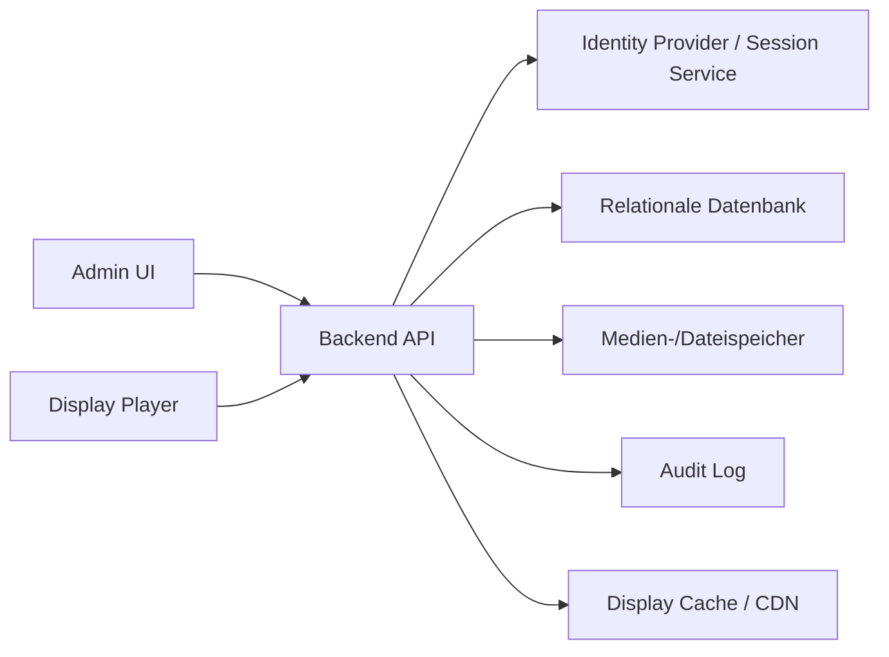

# IT Review Readiness

Stand: 2026-04-25

Dieses Dokument bereitet den Prototyp fuer eine technische Sichtung durch IT-Leitung und Umsetzungsteam vor. Ziel ist nicht, den Prototyp als produktionsfertig zu verkaufen. Ziel ist, fachliche Logik, Architekturgrenzen, Qualitaetsnachweise und den Weg zur produktiven Umsetzung transparent zu machen.

## Executive Summary fuer IT

Das Digitale Schwarze Brett ist ein Vue-3-Prototyp mit real nutzbarer Fachlogik fuer:

- Inhalte erstellen, validieren, einreichen, freigeben und revisionieren
- Standortbezogene Ausspielung auf Displays
- Freigabe-Queue mit Review-Historie
- Notfallmeldungen mit persistiertem Aktivstatus
- Display-Simulation mit Datum, Uhrzeit und Standort
- Template-Katalog mit Designer-Komponenten und sanitisiertem Legacy-HTML
- Rollen- und Rechte-Matrix
- Audit-Log fuer fachliche Aktionen

Der Prototyp verwendet bewusst `localStorage`, damit Fachbereich und Geschaeftsleitung die Prozesse ohne Backend erleben koennen. Fuer Produktion muss die Persistenzschicht durch API, Datenbank, Dateiablage, serverseitige Autorisierung und Geraeteauthentifizierung ersetzt werden.

## Was an diesem Code belastbar ist

- **Domain-Schnitt:** Admin, Display und Shared-Domain-Code sind getrennt.
- **Repository-Schicht:** Stores schreiben nicht mehr direkt in `localStorage`; die Persistenz liegt hinter Repository-Adaptern.
- **Permission-Matrix:** Rollenrechte sind zentral in `src/shared/auth/policies.js` definiert.
- **Freigabeprozess:** Live-Inhalte sind gesperrt; Aenderungen laufen ueber neue Revisionen.
- **Display-Engine:** Sichtbarkeit, Standortvererbung, Playlist-Auswahl und Navigation sind aus dem Vue-Composable in pure, testbare Module extrahiert.
- **Schedule-/Playlist-Regeln:** Zeitplanung und Playlist-Pflege liegen in reinen Domain-Modulen und sind unabhaengig von Vue getestet.
- **Validierung:** Publish- und Review-Aktionen pruefen Pflichtfelder, Template-Parameter, Medien und Gueltigkeit.
- **Sanitizing:** Legacy-HTML wird vor dem Rendern bereinigt.
- **Tests:** Kritische Fachregeln sind mit Vitest abgesichert.
- **Build-Faehigkeit:** Der Production-Build laeuft reproduzierbar ueber Vite.

## Was nicht produktiv ist

Diese Punkte duerfen nicht als Implementierungsdetail missverstanden werden. Sie sind bewusst Prototyp-Grenzen:

| Bereich | Prototyp | Produktion |
| --- | --- | --- |
| Auth | Clientseitige Demo-Sperre / Rollen im Browser | IdP oder Backend-Login, Sessions/JWT, serverseitige Rechtepruefung |
| Datenhaltung | `localStorage` | Datenbank mit Migrationen, Backups, Transaktionen |
| Dateien | Browser-Speicher / Public Assets | Object Storage, Virenscan, Groessenlimits, CDN/Cache-Konzept |
| Displays | URL-basierte Anzeige | Geraeteidentitaet, Standortbindung, Token Rotation |
| Sync | Browser lokaler Zustand | API, Realtime oder Polling, Konfliktstrategie |
| Audit | Clientseitiges Audit | Manipulationsgeschuetztes serverseitiges Audit |
| Betrieb | Vercel-Demo | Monitoring, Logging, SLA, Rollback, Datenschutzpruefung |

## Weiterfuehrende Uebergabedokumente

- [`IT_INTEGRATION_PLAN.md`](IT_INTEGRATION_PLAN.md) - Umsetzungsphasen, Aufgabenverteilung und Definition of Done
- [`API_CONTRACT.md`](API_CONTRACT.md) - benoetigte REST-API fuer Backend/Auth/Display
- [`DATA_MODEL.md`](DATA_MODEL.md) - fachliches Datenmodell und Statusuebergaenge
- [`ROLE_MATRIX.md`](ROLE_MATRIX.md) - Rollen, Permissions und SSO-Mapping
- [`MEDIA_STORAGE_CONCEPT.md`](MEDIA_STORAGE_CONCEPT.md) - Upload-/Storage-Zielarchitektur
- [`api/openapi.yaml`](api/openapi.yaml) - OpenAPI-Skelett fuer die technische Abstimmung

## Empfohlene Zielarchitektur



## Backend-Domaenen

- `ContentService`: Entwurf, Revision, Freigabe, Archivierung
- `TemplateService`: Template-Katalog, Parameter-Schema, Sanitizing-Regeln
- `ScheduleService`: Zeitfenster, Standort, Playlist, Prioritaet
- `DisplayService`: Standortgebundene Display-Payloads
- `EmergencyService`: Notfall-Broadcast mit Ablaufzeit und Quittierung
- `MediaService`: Upload, Konvertierung, Preview, Cache-Invalidierung
- `AuditService`: unveraenderbarer Ereignisstrom

## Review-Leitfaden fuer die IT

1. Domain-Grenzen pruefen: Stores, Repositories, Auth-Policy, Template-Validation.
2. Freigabeprozess nachspielen: erstellen, einreichen, pruefen, freigeben, Revision erstellen.
3. Standortlogik pruefen: globaler Inhalt vs. FB1/FB2/Verwaltung.
4. Display-Simulation pruefen: Datum, Uhrzeit, Standort und Auswahl vergleichen.
5. Produktionsgrenzen markieren: Auth, Storage, Medien, Audit und Sync sind Backend-Aufgaben.
6. Quality-Gate ausfuehren: `npm run check`.

## Quality Gate

Aktueller technischer Mindestcheck:

```sh
npm run check
```

Optionaler Dependency-Check:

```sh
npm run audit:prod
```

Fuer eine produktive IT-Uebergabe sollten zusaetzlich eingefuehrt werden:

- ESLint + Prettier oder Biome
- TypeScript oder mindestens JSDoc-Typen fuer Domain-Modelle
- E2E-Smoke-Tests fuer Admin-Workflow und Display
- CI-Pipeline mit `npm ci`, Tests, Build und Dependency-Audit
- Coverage-Report fuer Domain-Code

## Code-Qualitaetsstatus

### Bereits verbessert

- Freigegebene Inhalte sind gegen Direktbearbeitung gesperrt.
- Revisionen ersetzen freigegebene Inhalte nachvollziehbar.
- Aktive Notfaelle sind persistiert und reload-stabil.
- Date-only-Gueltigkeit behandelt Endtage korrekt.
- Template-HTML wird sanitisiert.
- Display-Preview transportiert den aktuellen Entwurf ueber Preview-Payload.
- Standortnamen und sichtbare deutsche UI-Copy wurden bereinigt.
- Publish-Wizard prueft Checklistenpunkte erst nach echter Eingabe.
- Publish-Wizard wurde in Step-Komponenten und ein Autosave-Composable zerlegt.
- Display-Content-Logik wurde in `src/shared/displayEngine/` ausgelagert und direkt getestet.
- Content-Editor wurde in Toolbar/Alert-Komponenten plus Draft-/Workflow-Composables zerlegt.
- Display-Simulation erklaert jetzt pro Zeitpunkt/Standort die aktive Playlist, Seitenquelle und Content-Ausschlussgruende.
- Zeitplanung wurde nach `src/shared/scheduling/` extrahiert: Validierung, Kalenderauswertung, Zeitfenster und Wochentage sind testbar.
- Playlist-Regeln wurden nach `src/shared/playlists/` extrahiert: Sortierung, Dauer, Legacy-Loop-Felder, Dubletten, nicht freigegebene Inhalte und fehlende Verweise werden sauber behandelt.
- Der Vorlagen-Katalog zeigt jetzt einen kuratierten Business-Katalog. Legacy-HTML-Vorlagen bleiben fuer Altinhalte renderbar, werden aber nicht mehr als normale Empfehlung angeboten.

### Noch offen fuer Produktion

- API-Repository statt `createLocalRepository(...)`
- Servervalidierung aller Freigabe- und Publish-Aktionen
- Zentrales Datenmodell mit Migrationen
- Rollenpruefung am Backend, nicht nur in der UI
- Medienstrategie fuer PDF/Video/Bilder
- Offline- und Cache-Invalidierung fuer Display-Geraete
- Konfliktbehandlung bei paralleler Bearbeitung
- Deployment-/Monitoring-Konzept

## Argumentation gegen "Vibe Coding"

Der Code sollte nicht nach Entstehungsweg bewertet werden, sondern nach technischen Artefakten:

- Gibt es klare Modulgrenzen?
- Gibt es reproduzierbare Tests?
- Sind Risiken dokumentiert?
- Sind Produktivgrenzen ehrlich benannt?
- Gibt es einen Migrationspfad?
- Sind sicherheitskritische Stellen isoliert?
- Kann ein Entwickler den Workflow lokal starten und pruefen?

Genau diese Punkte adressiert das Repo. Der Prototyp ist nicht der finale Produktivcode, aber er ist eine strukturierte fachliche Referenz und kann als belastbare Spezifikation fuer die IT-Umsetzung dienen.

## Vorschlag fuer Mittwoch

Formulierung gegenueber der IT-Leitung:

> "Das ist kein Versuch, einen Browser-Prototypen direkt produktiv zu nehmen. Der Wert liegt darin, dass Fachlogik, Rollen, Freigaben, Standortausspielung und Displayverhalten bereits klickbar validiert sind. Die IT soll daraus eine robuste Backend-Architektur bauen. Die produktionskritischen Grenzen sind bewusst dokumentiert."

Damit wird der Prototyp nicht als Blackbox verteidigt, sondern als pruefbarer fachlicher Vertragsentwurf positioniert.
